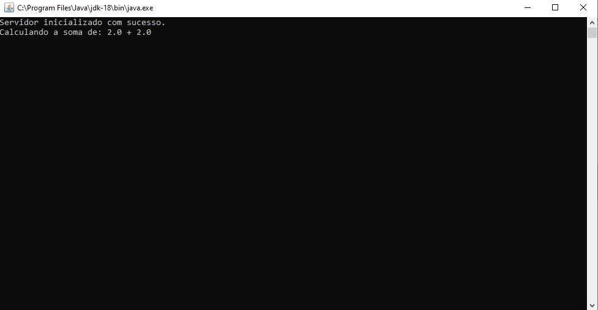
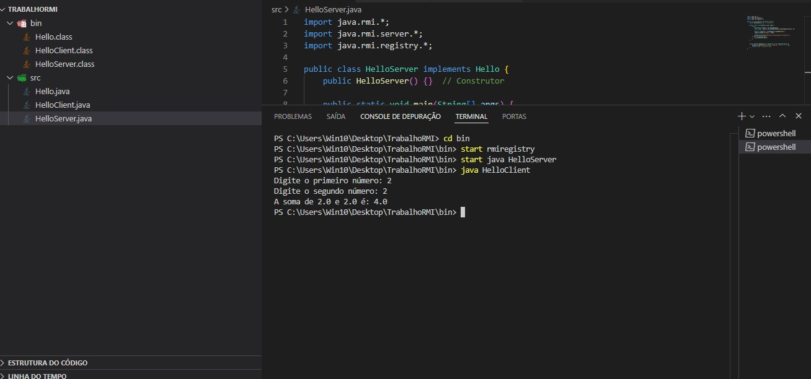

# Chamada Remota RMI - Sistemas Distribuídos

## Atividade Prática

Aluno: Hugo Leonardo Viana

Atividade prática realizada para a disciplina de Sistemas Distribuídos sob orientação do professor Jefferson Silva Lopes.

## Descrição

O intuito é realizar chamadas remotas de métodos via RMI do Java. Para o desenvolvimento do trabalho, foi utilizado um miniprojeto em Java (programa que soma dois números reais).

## Demonstração

O print a seguir mostra a chamada remota sendo realizada.

